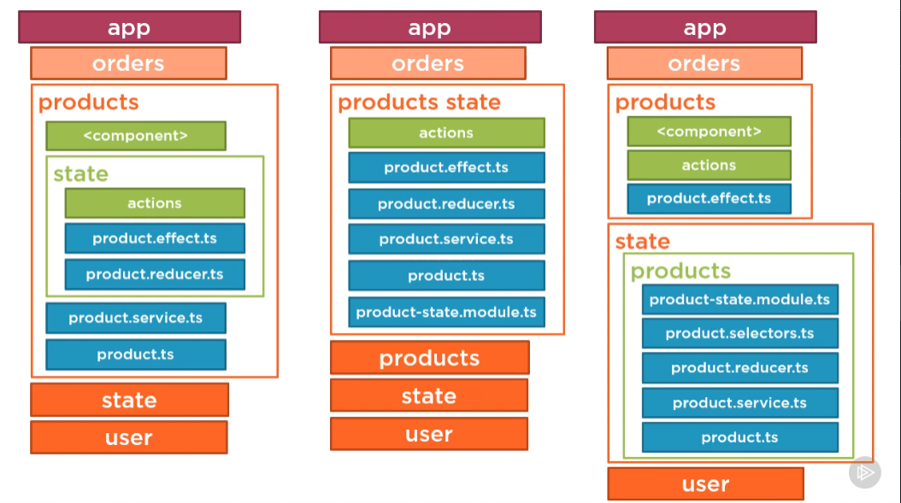

# NgRX

Pluralsight course project by Deborah Kurata.

Angular NgRx: Getting Started
[GitHub Repository](https://github.com/DeborahK/Angular-NgRx-GettingStarted)

Also see: Play by Play Angular and NgRx

## What is NgRX?

NgRx is a framework for building reactive applications in Angular. NgRx provides libraries for:

- Managing global and local state.
- Isolation of side effects to promote a cleaner component architecture.
- Entity collection management.
- Integration with the Angular Router.
- Developer tooling that enhances developer experience when building many different types of applications.

When NOT to use NgRx:

- Your team is new to Angular
- The application is simple
- Your team already has a good pattern for state management

## The Redux Pattern

Redux is a predictable state container for JavaScript applications:

- Single source of truth called: **Store**
- State is read only and only changed by dispatching **Actions**
- Changes are made using pure functions called: **Reducers**

Advantages:

- Centralized immutable state
- Performance (easier to implement OnPush detection strategy)
- Testability
- Tooling
- Component communication

_Redux is not great for making simple things quickly. It's great for making really hard things simple._

### The Store

What state shouldn't be kept in the store?

- Unshared state
- Angular form state
- Non serializable state (e.g.: Router state)

_The store follows the principle of immutability. We will replace the whole state object, and not just mutate part of it._

Advantages of store immutability:

- Increased performance
- Simpler programming and debugging

### Actions

All relevant user events are dispatched as actions, affecting reducers who update the store.

Examples:

- Login action after login form submission
- Toggle side menu action after a button click
- Retrieve data action when initializing a component
- Start global spinner action when saving data

```json
{
  "type": "LOGIN",
  "user": { "username": "Duncan", "password": "secret" }
}
```

### Reducers

Pure functions that specify how state changes in response to an action.

Examples:

- Set userDetails property on login
- Toggle a sideMenuVisible property to true on button click
- Set successfully retrieved data on component initialization
- Set a globalSpinnerVisible property to true while saving data

Pure function:

- Given the same arguments, will always return the same value (doesn't use variables outside of function scope)
- No observable side-effects (doesn't mutate variables outside of function scope)

## Install The Store

> ng add @ngrx/store
> ng add @ngrx/store@latest --no-minimal --statePath core/reducers

## Install The Devtools

- Install Chrome Redux DevTools

-Run

> ng add @ngrx/store-devtools@latest

- Initialize the devtools module

## Install Effects

> ng add @ngrx/effects@latest

### Operators in Effects

SwitchMap

- Cancels the current subscription/request and can cause race conditions
- Use for get requests or cancelable requests like searches

ConcatMap

- Runs subscriptions/requests in order and is less performant
- Use for get, post and put requests when order is important

MergeMap

- Runs subscription/requests in parallel and is more performant
- Use for get, put, post and delete requests when order is not important

ExhaustMap

- Ignores all subsequent subscriptions/requests until it completes
- Use for login when you don't want more requests until the initial one is complete

## State Module

In some cases we might want to share state between 2 or more lazy loaded modules.



## Additional NgRx Libraries

ngrx/entity

- Helps with CRUD operations on collections of entities
- Provides helper functions for managing entity collections
- Reduces the amount of boilerplate code needed to manage entity collections

ngrx/schematics

- Helps with scaffolding new NgRx projects
  - ng generate store
  - ng generate reducer
  - ng generate action
  - ng generate effect
  - ng generate feature
  - ng generate container
  - ng generate entity

ngrx/router-store

- Connects the router to the store
- Dispatches router navigation actions

ngrx/data

- Abstracts away the NgRx entity code
- Configuration and convention, not code
  - No actions or action creators
  - No reducers
  - No selectors
  - No effects
  - No code generation
- Extension points for customization

ngrx/component (experimental)

- Set of Helpers to enable more fully reactive applications
  - ngrxPush pipe
  - ngrxLet directive
  - ...

---

Date of creation: 8-30-2021
